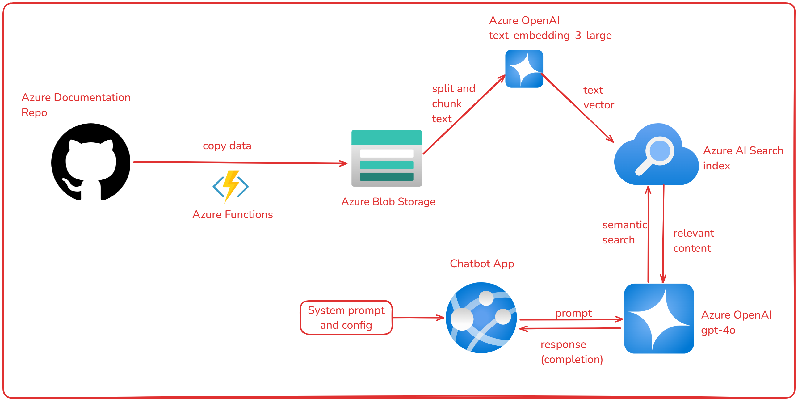

# Projeto de Ingestão de Dados e Implementação de IA no Azure

Este projeto tem como objetivo criar um crawler para ingestão de dados da documentação do Azure e implementar recursos de IA no Azure utilizando Infraestrutura como Código (IaC) e Python.

## Objetivo do Projeto

O objetivo deste projeto é automatizar a ingestão de dados de repositórios do GitHub, especificamente da documentação do Azure, e armazená-los no Azure Blob Storage. Além disso, o projeto implementa recursos de IA no Azure, como Azure Cognitive Search e Azure OpenAI, para processar e analisar os dados ingeridos.

## Estrutura do Projeto

O projeto está dividido em duas partes principais:

1. **Infraestrutura**: Configuração dos recursos do Azure utilizando Bicep e scripts de implantação.
2. **Crawler**: Implementação do crawler em Python para ingestão de dados do GitHub e armazenamento no Azure Blob Storage.

## Referências

- [Infraestrutura do Projeto](infra/README.md)
- [Crawler do Projeto](src/repo_crawler/README.md)

## Diagrama do Projeto



## Como Executar

### Pré-requisitos

- Azure CLI instalado
- Conta no Azure com permissões para criar recursos
- Python 3.11 instalado

### Passos para Configuração

1. Clone o repositório:
    ```sh
    git clone <URL_DO_REPOSITORIO>
    cd <NOME_DO_REPOSITORIO>
    ```

2. Configure os parâmetros no arquivo [parameters.json](http://_vscodecontentref_/0).

3. Execute o script de implantação e siga os passos orientados no terminal:
    ```sh
    ./infra/deploy.ps1
    ```

4. Preencha o arquivo `.env` executando o script [fill_env.sh](http://_vscodecontentref_/1):
    ```sh
    ./infra/config/fill_env.sh <ResourceGroup>
    ```

5. Crie um ambiente virtual Python e instale as dependências:
    ```sh
    python -m venv venv
    source venv/bin/activate
    pip install -r src/repo_crawler/requirements.txt
    ```

6. Execute o script Python para configurar o AI Search:
    ```sh
    python infra/config/search_config.py
    ```

7. Verifique se a configuração foi bem-sucedida acessando o portal do Azure e validando os recursos criados.

## Contribuição

Sinta-se à vontade para contribuir com este projeto. Para isso, faça um fork do repositório, crie uma branch para suas alterações e envie um pull request.
