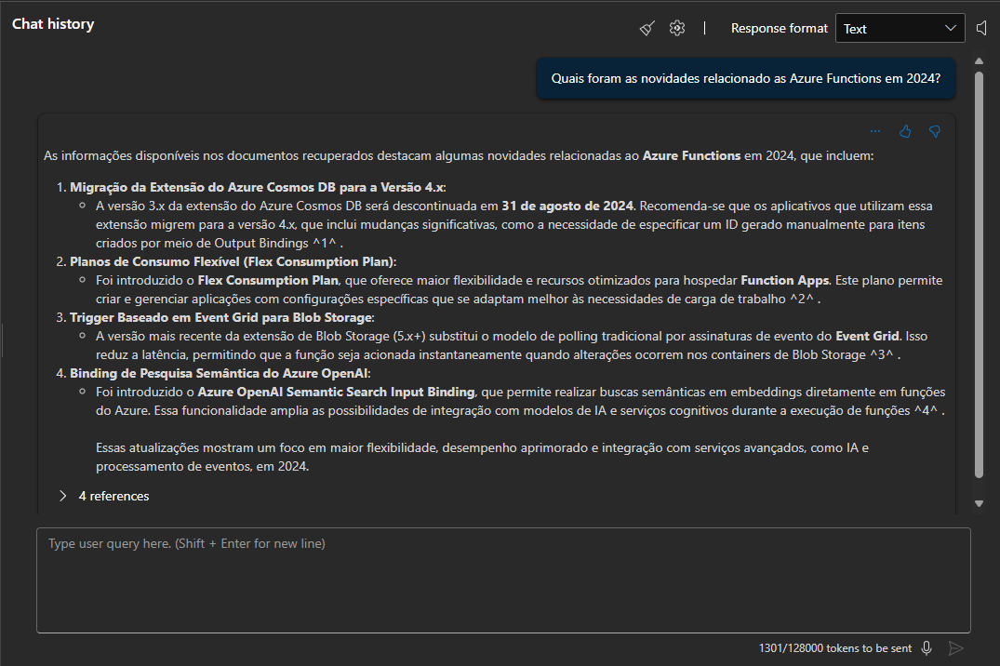
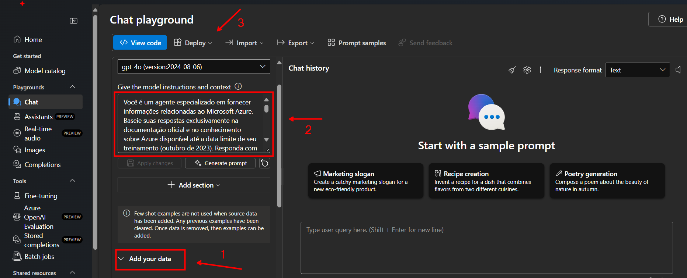
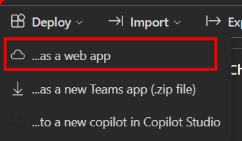
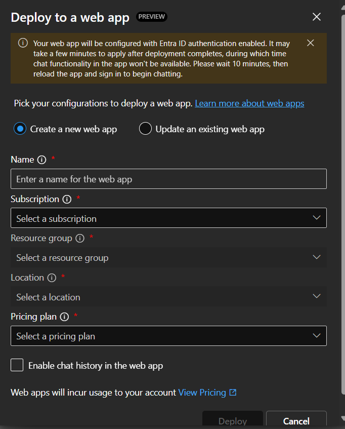

# Projeto de Ingestão de Dados e Implementação de IA no Azure
Este projeto visa criar um crawler para ingestão de dados da documentação do Azure e implementar recursos de IA no Azure utilizando Infraestrutura como Código (IaC) e Python.

## Objetivo do Projeto

O objetivo deste projeto é automatizar a ingestão de dados de repositórios do GitHub, especificamente da documentação do Azure, e armazená-los no Azure Blob Storage. Além disso, o projeto implementa recursos de IA no Azure, como Azure AI Search e Azure OpenAI, para processar e analisar os dados ingeridos.

## O Chatbot

O objetivo final do projeto é ter um chatbot especializado em determinado escopo. E o escopo é facilmente alterável, simplesmente sincronizando mais dados ao índice e alterando o contexto inicial do agente.

Neste projeto, o agente é especializado em Azure Functions, e temos a disposição toda a documentação mais atualizada sobre o assunto no banco vetorial para embasar as respostas da LLM.




## Estrutura do Projeto

O projeto está dividido em duas partes principais:

1. **Infraestrutura**: Configuração dos recursos do Azure utilizando Bicep e scripts de implantação.
2. **Crawler**: Implementação do crawler em Python para ingestão de dados do GitHub e armazenamento no Azure Blob Storage.

## Referências

- [Infraestrutura do Projeto](infra/README.md)
- [Crawler do Projeto](src/repo_crawler/README.md)

## Diagrama do Projeto


## Como Executar

### Pré-requisitos

- Azure CLI instalado
- Cinhecimento básico em Azure Functions e nas ferramentas de IA do Azure
- Conta no Azure com permissões para criar recursos
- Python 3.11 instalado

### Passos para Configuração

1. Clone o repositório:
    ```sh
    git clone <URL_DO_REPOSITORIO>
    cd <NOME_DO_REPOSITORIO>
    ```

2. Configure os parâmetros no arquivo [parameters.json](http://_vscodecontentref_/0).

3. Execute o script de implantação e siga os passos orientados no terminal:
    ```sh
    ./infra/deploy.ps1
    ```

4. Preencha o arquivo `.env` executando o script [fill_env.sh](http://_vscodecontentref_/1):
    ```sh
    ./infra/config/fill_env.sh <ResourceGroup>
    ```

5. O Crawler é uma Azure Functions configurada para ser executada diariamente. Faça o deploy usando a extensão do VS Code ou o CI/CD configurado no GitHub e configure as variáveis de ambiente.

### Variáveis de Ambiente

As variáveis de ambiente são utilizadas para configurar a Azure Function com os parâmetros necessários para sua execução. As seguintes variáveis de ambiente devem ser configuradas:

- `AzureWebJobsStorage`: String de conexão para o Azure Blob Storage.
- `FUNCTIONS_WORKER_RUNTIME`: Define o runtime da função, neste caso, "python".
- `GITHUB_REPO`: Repositório do GitHub que contém a documentação do Azure.
- `AZURE_STORAGE_CONTAINER`: Nome do container no Azure Blob Storage onde os dados serão armazenados.
- `FOLDERS_TO_INCLUDE`: Pastas do repositório do GitHub que serão incluídas na ingestão de dados.
- `DAYS_AGO`: Número de dias para considerar na ingestão de dados.

### Configuração das Variáveis de Ambiente

1. No portal do Azure, navegue até a Azure Function que você criou.
2. No menu lateral, selecione "Configurações de Aplicativo" (Application Settings).
3. Adicione cada uma das variáveis de ambiente listadas acima com seus respectivos valores.
4. Salve as configurações e reinicie a Azure Function para que as novas configurações sejam aplicadas.

Exemplo de configuração no arquivo `local.settings.json`:

```json
{
    "IsEncrypted": false,
    "Values": {
        "AzureWebJobsStorage": "<sua-string-de-conexao>",
        "FUNCTIONS_WORKER_RUNTIME": "python",
        "GITHUB_REPO": "MicrosoftDocs/azure-docs",
        "AZURE_STORAGE_CONTAINER": "public",
        "FOLDERS_TO_INCLUDE": "['articles/azure-functions', 'includes']",
        "DAYS_AGO": "3"
    }
}
```

6. Execute o script Python para configurar o AI Search:
    ```sh
    python infra/config/search_config.py
    ```

7. Verifique se a configuração foi bem-sucedida acessando o portal do Azure e validando os recursos criados.

## Contribuição

Sinta-se à vontade para contribuir com este projeto. Para isso, faça um fork do repositório, crie uma branch para suas alterações e envie um pull request.

## Implementação do Chatbot

Após implantar todos os recursos, use o Azure AI Foundry para criar um agente especializado no domínio do índice (neste caso, Azure). Configure o contexto para delimitar como e o que ele deve responder. Faça o deploy em um App Service pelo próprio playground do AI Foundry.



1. Adicione seus dados conectando no índice do Azure AI Search
2. Especifique o contexto (prompt inicial) que delimita como e o quê o agente pode responder
3. Faça o deploy da aplicação

### Deploy

Escolha o deploy para o Web App



Crie um novo Web App com as informações desejadas. O Web App vai incorrer em novos custos, então leve isso em consideração.





## Links Úteis

- [Repositório do chatbot](https://github.com/microsoft/sample-app-aoai-chatGPT)

